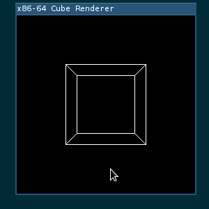

# x86-cube-renderer
Sigh... Cube renderer in x86-64 assembly (NASM).

### Presentation
Use WASD and QE keys for movement, UHJK and YI keys for rotation.



Progarm uses SDL to only do 2 things: display the generated bitmap and handle user input. Everything else is coded in NASM. 
I use [Bresenham's line algorithm](https://en.wikipedia.org/wiki/Bresenham%27s_line_algorithm) to draw lines. Matrix multiplication uses [SSE](https://en.wikipedia.org/wiki/Streaming_SIMD_Extensions). Some use of legacy FPU since I wanted to learn it too :).

### Dependencies
* gcc
* make
* nasm
* SDL2

### Installation
Just type
```
make all
```
